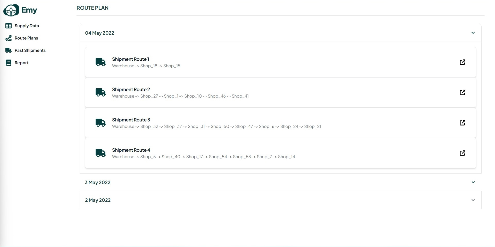
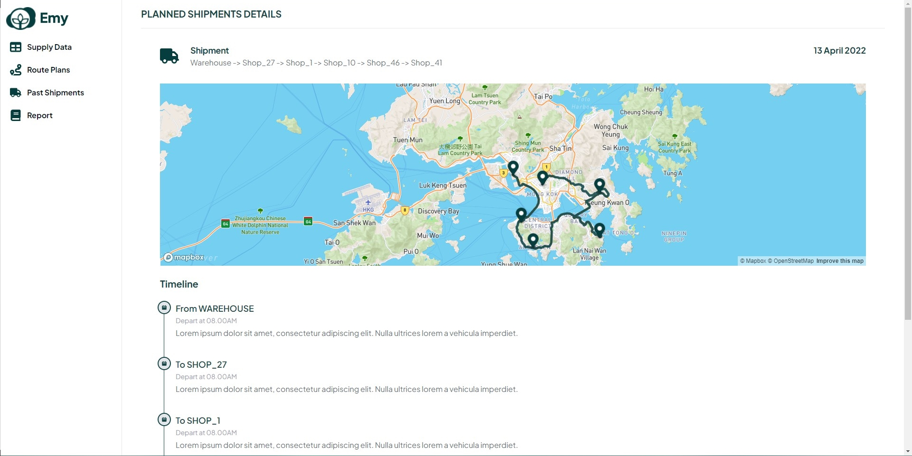
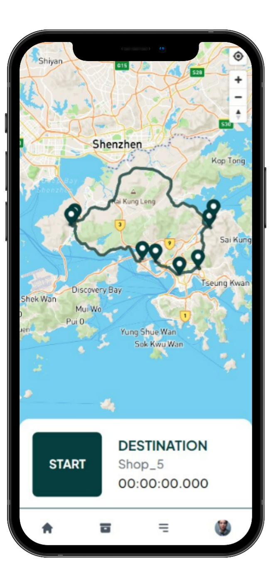
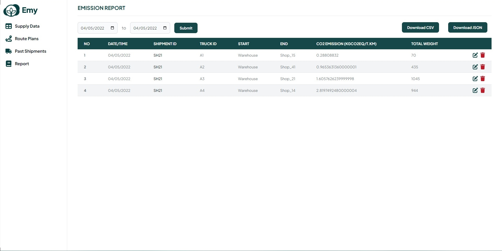

# Emy

Introducing Emy a distribution dashboard to optimize routes for reducing carbon emissions and costs. Emy provides an optimized route based on placed orders which can calculate the most minimal emission rate for supply chain distribution. We provide a tracking app for drivers which are automatically sent to companies' Emy dashboards for easier reporting. Emy provides a near approximation of carbon emissions by taking into account the weight of trucks in each stop.

## Team Anagata

- Enryl Einhard (Leader)
- Verena Andrea Wibisono
- Keane Dylan Yennoto
- Benedict Ronaldo Gustaf
- Stefan Rafael Muljadi

## Product Features

### Route Optimization

To reduce company costs and CO2 emissions in downstream scope 3 emissions, Emy’s optimizer works by taking into account all shipments orders within the same drop-off date. This is then calculated with the distribution’s company infrastructure of warehouses and stores to produce the optimized distribution route. 

### Tracking App

Our service provides easy tracking for each truck on a designated route. The app shows each driver’s designated optimized routes. Furthermore, the tracking data is synced live to the database.

### Emission Report Dashboard

We provide dashboard reports which show the CO2 emission of each truck and route With Emy, enterprises can easily view and download emission shipment data and use it for ESG reporting. 

## Technology
- Python
- Vue.js
- Javascript
- MongoDB
- Tailwind CSS
- FastAPI
- Pandas
- NumPy
- Vercel
- Google Maps API
- OR-Tools
- MapBox

